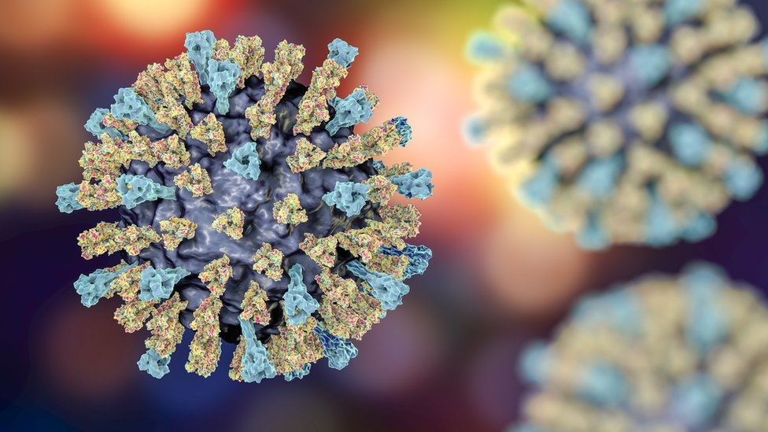

# World-Measles-Dataset

The World Measles Dataset is a comprehensive collection of data from the World Health Organization(W.H.O.) on reported cases of measles across the globe from the year 2011 to 2022. This is a SQL/Tableau project aimed at getting insight into the viral infection of measles across the 194 member country.

**_Disclaimer_**: _Measles cases are defined as laboratory confirmed, epidemiologically linked, and clinical cases as reported to the World Health Organization. Some countries report cases at irregular intervals, providing multiple months of data in a one month period. Future months are reported as 0 and will be updated as data is available._

## Problem Statement
1.  What is the total reported cases?
2.  Which region has the highest reported cases?
3.  Which Country has the highest reported case?
4.  What is the year on year trends per country?
