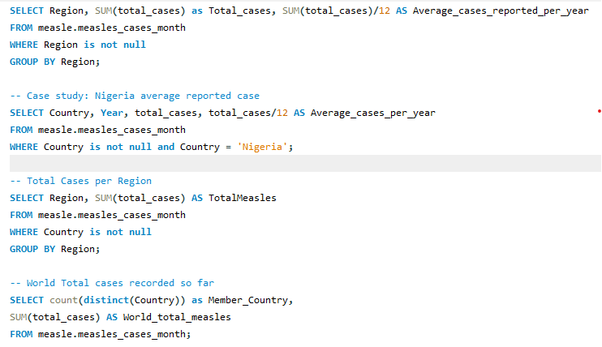
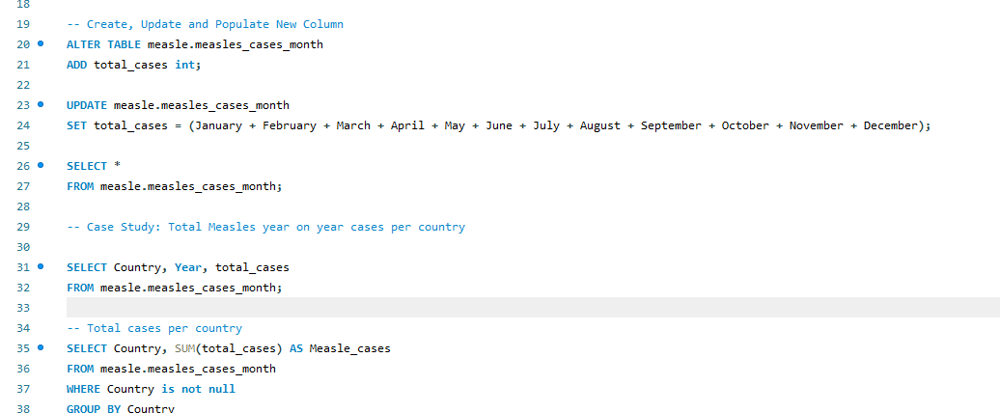
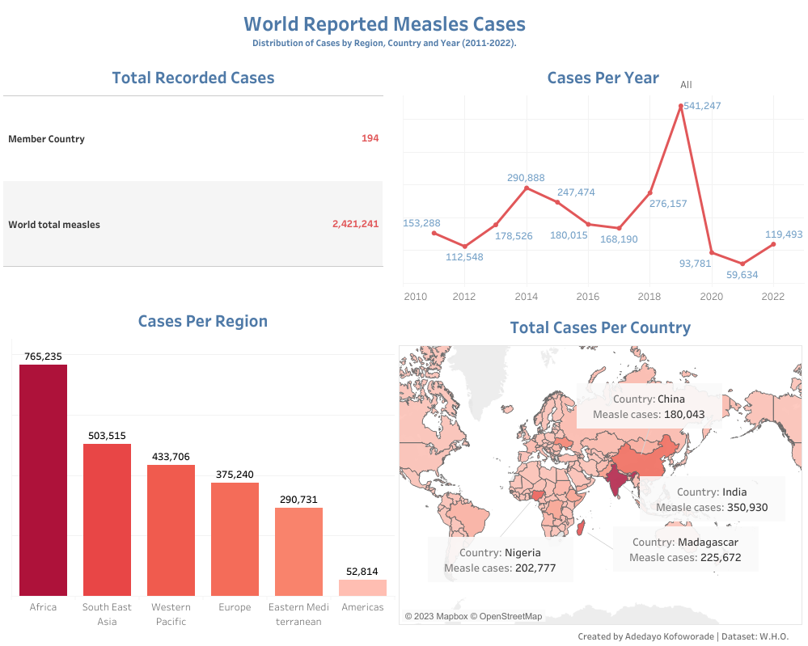

# Reported Measle Cases

This is a comprehensive collection of data from the World Health Organization(W.H.O.) on reported measle cases across the globe from the year 2011 to 2022. This is a SQL/Tableau project aimed at getting insight into the viral infection of measles across the 194 member country.

**_Disclaimer_**: _Measles cases are defined as laboratory confirmed, epidemiologically linked, and clinical cases as reported to the World Health Organization. Some countries report cases at irregular intervals, providing multiple months of data in a one month period. Future months are reported as 0 and will be updated as data is available._

## Problem Statement
1.  What is the total reported Measle cases?
2.  Which region has the highest reported cases?
3.  Which Country has the highest reported case?
4.  What is the year on year trends per country?

## Analysis
MySQL was used to querry and interact with 2328 rows of reported measle Cases to get an understanding of the data towards solving the problem statements and providing the needed insights.
Here is a preview of the querry language used for the analysis 👇

       |       
:--------------------:|:-----------------------:

## Visualization
Tableau is the tool of choice used for the visual presentation of the insights gotten.
The visuals are spread through the following four Charts to simplify the reports and make it easy to navigate
- Total Recorded Cases
- Cases Per Year
- Cases Per Region
- Total Cases Per Country

Cases Per Country trend chart has a filter dropdown of year on year cases per country.
You can interract further with the dashboard [here](https://public.tableau.com/app/profile/adedayo1601/viz/ReportedMeaslesData/Dashboard1)

## Conclusions
- Africa has the highest reported cases of the six regions.
- 2019 recorded the peak period of measle cases amidst the period in consideration.
- India, Madagasgar, Nigeria, China and Philippines has the highest number of reported cases.

## Recommendations
The measles vaccine should be distributed evenly and efficiently in regions and areas that's most affected.

